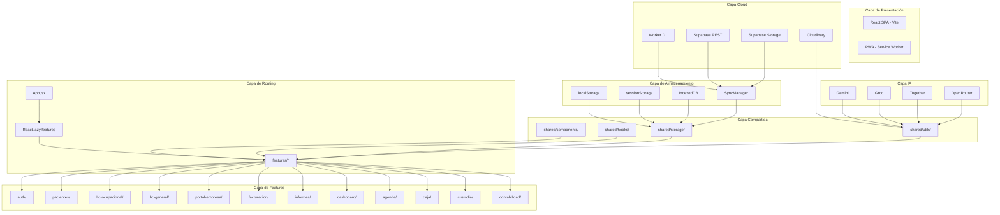
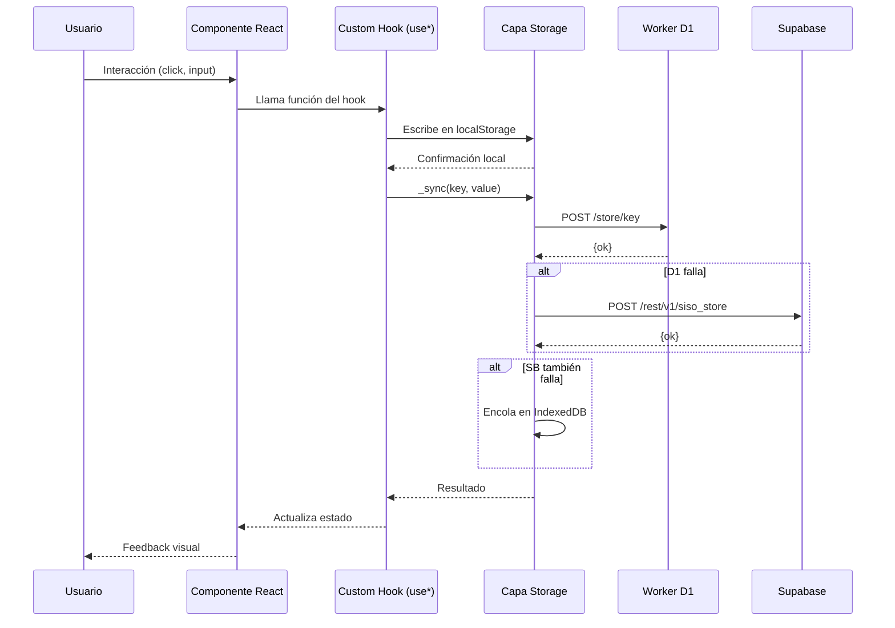
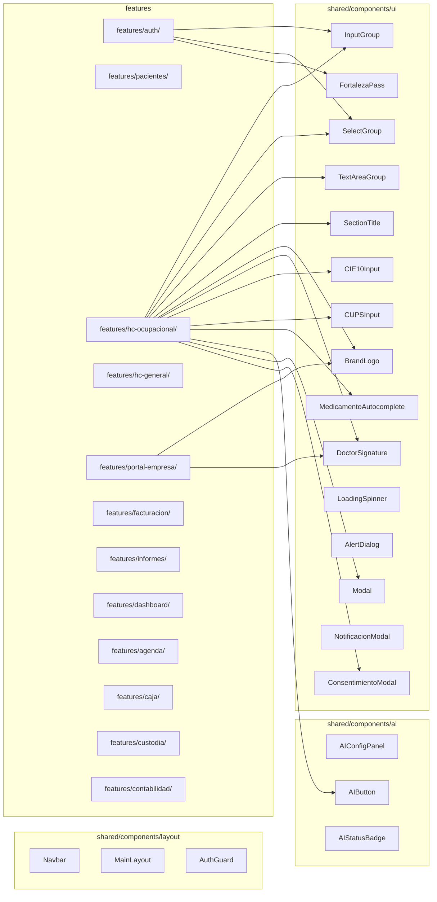

# ═══════════════════════════════════════════════════════════════
# ARQUITECTURA OBJETIVO — SISO OcupaSalud
# FASE 3: Diseño Arquitectónico
# Versión: 1.0 | Fecha: 2026-06-11
# ═══════════════════════════════════════════════════════════════

## ═══════════════════════════════════════════════════════════════
## 1. DIAGRAMA DE ALTO NIVEL
## ═══════════════════════════════════════════════════════════════



## ═══════════════════════════════════════════════════════════════
## 2. DIAGRAMA DE FLUJO DE DATOS
## ═══════════════════════════════════════════════════════════════



## ═══════════════════════════════════════════════════════════════
## 3. DIAGRAMA DE COMPONENTES
## ═══════════════════════════════════════════════════════════════



## ═══════════════════════════════════════════════════════════════
## 4. ESTRUCTURA DE CARPETAS COMPLETA
## ═══════════════════════════════════════════════════════════════

```
C:\Users\JQK3\Desktop\refactorizacion total\
├── docs/                              # Documentación del proyecto
│   ├── PROTOCOLO_MAESTRO.md
│   ├── MAPA_FUNCIONAL.md
│   ├── CLAVES_STORAGE.json
│   ├── GRAFO_DEPENDENCIAS.mermaid
│   ├── FUNCIONES_INDEX.json
│   ├── DIAGNOSTICO.md
│   ├── PLAN_REFACTOR.md
│   ├── ARQUITECTURA_OBJETIVO.md
│   ├── REFACTOR_RESULTADO_FINAL.md    # (al finalizar)
│   └── ETAPAS/                        # Documentos por etapa
│       ├── etapa-A.md
│       ├── etapa-B.md
│       └── ... hasta etapa-N.md
│
├── src/                               # Código fuente refactorizado
│   ├── main.jsx                       # Entry point (sin cambios)
│   ├── App.jsx                        # Solo router + lazy loading
│   ├── AppInner.jsx                   # (temporal, se disuelve)
│   ├── styles.css                     # Estilos globales
│   │
│   ├── features/                      # Features por dominio
│   │   ├── auth/
│   │   │   ├── LoginForm.jsx
│   │   │   ├── UsersPage.jsx
│   │   │   ├── ChangePasswordForm.jsx
│   │   │   ├── SecurityPanel.jsx
│   │   │   ├── LicenciasTab.jsx
│   │   │   └── useAuth.js
│   │   │
│   │   ├── pacientes/
│   │   │   ├── PacientesPage.jsx
│   │   │   ├── PacienteForm.jsx
│   │   │   ├── PacienteHistory.jsx
│   │   │   ├── CargaMasivaExamenes.jsx
│   │   │   └── usePacientes.js
│   │   │
│   │   ├── hc-ocupacional/
│   │   │   ├── HCOcupacionalForm.jsx
│   │   │   ├── sections/
│   │   │   │   ├── AnamnesisSection.jsx
│   │   │   │   ├── ExamenFisicoSection.jsx
│   │   │   │   ├── SistemasSection.jsx
│   │   │   │   ├── RestriccionesSection.jsx
│   │   │   │   ├── RecomendacionesSection.jsx
│   │   │   │   └── FormulaDerivacionSection.jsx
│   │   │   ├── HCOcupacionalPrint.jsx
│   │   │   ├── HCOcupacionalClose.jsx
│   │   │   └── useHCOcupacional.js
│   │   │
│   │   ├── hc-general/
│   │   │   ├── HCGeneralForm.jsx
│   │   │   ├── HCGeneralPrint.jsx
│   │   │   └── useHCGeneral.js
│   │   │
│   │   ├── portal-empresa/
│   │   │   ├── PortalEmpresa.jsx
│   │   │   ├── PortalLogin.jsx
│   │   │   ├── PortalDashboard.jsx
│   │   │   ├── PortalCertificados.jsx
│   │   │   ├── PortalCuentasCobro.jsx
│   │   │   ├── PortalCustodia.jsx
│   │   │   ├── PortalInformes.jsx
│   │   │   └── usePortal.js
│   │   │
│   │   ├── facturacion/
│   │   │   ├── BillPage.jsx
│   │   │   ├── BillForm.jsx
│   │   │   ├── BillPrint.jsx
│   │   │   ├── BillDIAN.jsx
│   │   │   └── useBills.js
│   │   │
│   │   ├── informes/
│   │   │   ├── InformePage.jsx
│   │   │   ├── InformeForm.jsx
│   │   │   ├── InformePrint.jsx
│   │   │   └── useInformes.js
│   │   │
│   │   ├── dashboard/
│   │   │   ├── DashboardPage.jsx
│   │   │   ├── StatsCards.jsx
│   │   │   ├── ChartsSection.jsx
│   │   │   └── useDashboard.js
│   │   │
│   │   ├── agenda/
│   │   │   ├── AgendaPage.jsx
│   │   │   ├── AgendaCalendar.jsx
│   │   │   ├── AgendaForm.jsx
│   │   │   └── useAgenda.js
│   │   │
│   │   ├── caja/
│   │   │   ├── CajaPage.jsx
│   │   │   └── useCaja.js
│   │   │
│   │   ├── custodia/
│   │   │   ├── CustodiaPage.jsx
│   │   │   ├── CustodiaForm.jsx
│   │   │   ├── CustodiaPrint.jsx
│   │   │   └── useCustodia.js
│   │   │
│   │   ├── contabilidad/
│   │   │   ├── ContabilidadPage.jsx
│   │   │   └── useContabilidad.js
│   │   │
│   │   └── encuestas/
│   │       ├── EncuestaPage.jsx
│   │       ├── EncuestaForm.jsx
│   │       └── useEncuestas.js
│   │
│   ├── shared/
│   │   ├── storage/
│   │   │   ├── localStorage.js
│   │   │   ├── sessionStorage.js
│   │   │   ├── supabaseClient.js
│   │   │   ├── supabaseStorage.js
│   │   │   ├── d1Client.js
│   │   │   ├── cloudinaryClient.js
│   │   │   ├── offlineDB.js
│   │   │   ├── syncManager.js
│   │   │   └── storageKeys.js
│   │   │
│   │   ├── sync/
│   │   │   ├── syncQueue.js
│   │   │   └── syncAudit.js
│   │   │
│   │   ├── hooks/
│   │   │   ├── useLocalStorage.js
│   │   │   ├── useSessionStorage.js
│   │   │   ├── useDebounce.js
│   │   │   ├── useOnlineStatus.js
│   │   │   └── useInterval.js
│   │   │
│   │   ├── components/
│   │   │   ├── ui/
│   │   │   │   ├── InputGroup.jsx
│   │   │   │   ├── SelectGroup.jsx
│   │   │   │   ├── TextAreaGroup.jsx
│   │   │   │   ├── SectionTitle.jsx
│   │   │   │   ├── BrandLogo.jsx
│   │   │   │   ├── DoctorSignature.jsx
│   │   │   │   ├── CIE10Input.jsx
│   │   │   │   ├── CUPSInput.jsx
│   │   │   │   ├── MedicamentoAutocomplete.jsx
│   │   │   │   ├── FortalezaPass.jsx
│   │   │   │   ├── LoadingSpinner.jsx
│   │   │   │   ├── AlertDialog.jsx
│   │   │   │   ├── ConfirmDialog.jsx
│   │   │   │   ├── Modal.jsx
│   │   │   │   ├── NotificacionModal.jsx
│   │   │   │   ├── ConsentimientoModal.jsx
│   │   │   │   └── PrivacyModal.jsx
│   │   │   ├── ai/
│   │   │   │   ├── AIConfigPanel.jsx
│   │   │   │   ├── AIButton.jsx
│   │   │   │   └── AIStatusBadge.jsx
│   │   │   └── layout/
│   │   │       ├── Navbar.jsx
│   │   │       ├── Sidebar.jsx
│   │   │       ├── MainLayout.jsx
│   │   │       └── AuthGuard.jsx
│   │   │
│   │   └── utils/
│   │       ├── constants.js
│   │       ├── sanitize.js
│   │       ├── validators.js
│   │       ├── formatters.js
│   │       ├── security.js
│   │       ├── hashHelpers.js
│   │       ├── normativa.js
│   │       ├── totp.js
│   │       ├── aiProviders.js
│   │       ├── fhir.js
│   │       ├── portalTemplates.js
│   │       ├── certificateTemplates.js
│   │       ├── dianXML.js
│   │       ├── emailTemplates.js
│   │       └── pdf.js
│   │
│   └── pages/                     # Páginas slim (wrappers)
│       ├── Agenda.jsx
│       ├── Bill.jsx
│       ├── Caja.jsx
│       ├── CartaCustodia.jsx
│       ├── Companies.jsx
│       ├── ContabilidadV2.jsx
│       ├── Dashboard.jsx
│       ├── Historia.jsx
│       ├── Planes.jsx
│       ├── PortalCertificadosEmpresa.jsx
│       ├── Reporte.jsx
│       └── Users.jsx
│
├── siso-worker/                    # Sin cambios
│   ├── index.js
│   ├── schema.sql
│   └── wrangler.json
│
├── scripts/                        # Scripts mantenidos
│   ├── snapshot.mjs               # (nuevo)
│   ├── restore-from-snapshot.mjs  # (nuevo)
│   └── ... (scripts existentes)
│
├── public/                         # Assets (sin cambios)
├── index.html
├── package.json
├── vite.config.js
└── vitest.config.js                # (nuevo)
```

## ═══════════════════════════════════════════════════════════════
## 5. PATRONES DE DISEÑO
## ═══════════════════════════════════════════════════════════════

### 5.1 Patrón Feature-Sliced Design (FSD)
Cada feature es autocontenida con su propio hook, componentes y lógica.
```
features/pacientes/
├── PacientesPage.jsx   → Vista (orquestador)
├── PacienteForm.jsx    → UI (formulario)
├── PacienteHistory.jsx  → UI (historial)
└── usePacientes.js     → Hook (toda la lógica)
```

### 5.2 Patrón Hook + Capa Storage
```
Componente → Hook (useFeature) → Storage Layer (shared/storage/)
                                  → Utils Layer (shared/utils/)
                                  → Cloud APIs (D1/Supabase)
```

### 5.3 Patrón de Persistencia Híbrida
```
Escritura: localStorage (inmediato) → D1 (autoritativo) → Supabase (fallback) → IndexedDB (cola offline)
Lectura:  IndexedDB (rápido + offline) → localStorage (fallback) → D1 (refresh background)
```

## ═══════════════════════════════════════════════════════════════
## 6. ESTRATEGIA DE LAZY LOADING
## ═══════════════════════════════════════════════════════════════

```javascript
// App.jsx final — solo router con lazy loading
import React, { lazy, Suspense } from 'react';

const Dashboard = lazy(() => import('./features/dashboard/DashboardPage'));
const Pacientes = lazy(() => import('./features/pacientes/PacientesPage'));
const HCOcupacional = lazy(() => import('./features/hc-ocupacional/HCOcupacionalForm'));
const HCGeneral = lazy(() => import('./features/hc-general/HCGeneralForm'));
const Bill = lazy(() => import('./features/facturacion/BillPage'));
const Reporte = lazy(() => import('./features/informes/InformePage'));
const Agenda = lazy(() => import('./features/agenda/AgendaPage'));
const Caja = lazy(() => import('./features/caja/CajaPage'));
const Custodia = lazy(() => import('./features/custodia/CustodiaPage'));
const Contabilidad = lazy(() => import('./features/contabilidad/ContabilidadPage'));
const PortalEmpresa = lazy(() => import('./features/portal-empresa/PortalEmpresa'));
const Users = lazy(() => import('./features/auth/UsersPage'));
const Login = lazy(() => import('./features/auth/LoginForm'));

function App() {
  return (
    <MainLayout>
      <Suspense fallback={<LoadingSpinner />}>
        <Router views={{ Dashboard, Pacientes, HCOcupacional, ... }} />
      </Suspense>
    </MainLayout>
  );
}
```

## ═══════════════════════════════════════════════════════════════
## 7. ESTRATEGIA DE TESTING
## ═══════════════════════════════════════════════════════════════

### 7.1 Configuración (vitest.config.js)
```javascript
import { defineConfig } from 'vitest/config';
export default defineConfig({
  test: {
    environment: 'jsdom',
    globals: true,
    setupFiles: ['./src/test/setup.js'],
    coverage: {
      provider: 'v8',
      reporter: ['text', 'json', 'html'],
      include: ['src/**/*.{js,jsx}'],
      exclude: ['src/**/*.test.*', 'src/test/'],
    },
  },
});
```

### 7.2 Pirámide de Testing
```
         ╱╲
        ╱ E2E ╲          3 tests E2E (Playwright)
       ╱───────╲
      ╱ Integra ╲        ~15 tests de integración
     ╱───────────╲
    ╱  Unitarios  ╲      ~50 tests unitarios
   ╱───────────────╲
```

### 7.3 Tests por Categoría

| Categoría | Archivos | Tests |
|-----------|----------|-------|
| Unitarios - Utils | shared/utils/*.test.js | 30+ |
| Unitarios - Storage | shared/storage/*.test.js | 15+ |
| Integración - Features | features/*/use*.test.js | 15+ |
| E2E - Flujo completo | e2e/*.spec.js | 3 |

---

*Documento generado como parte de FASE 3 del Protocolo Maestro de Refactorización.*